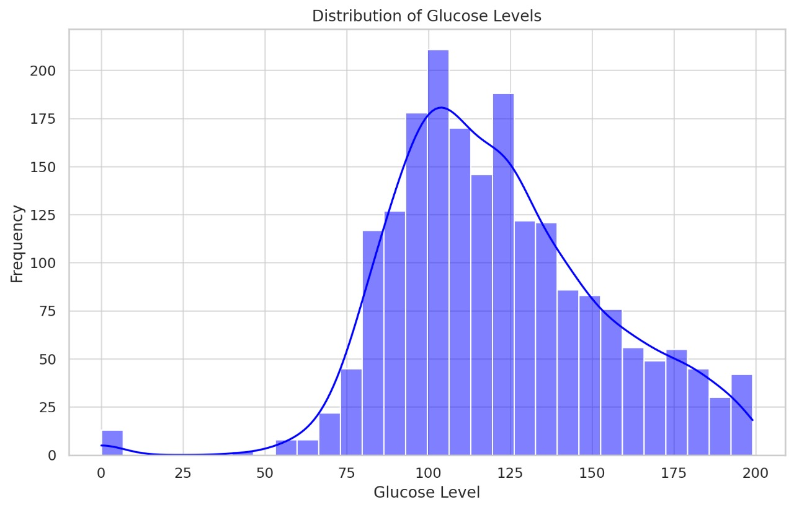
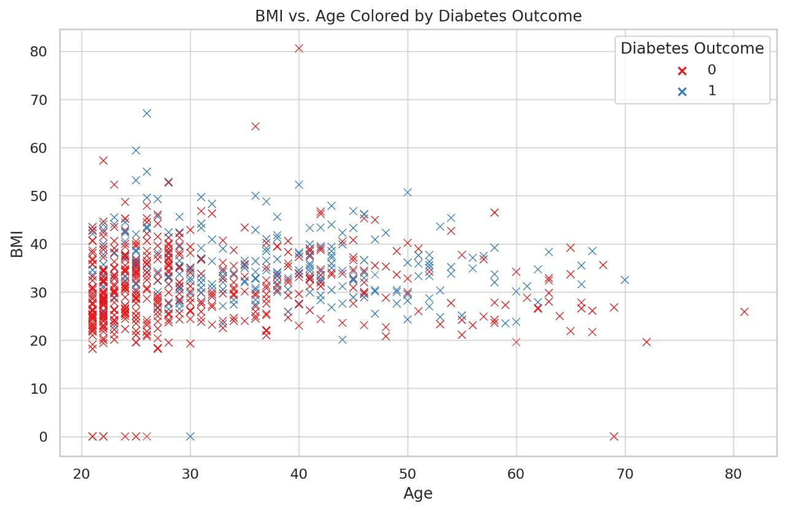
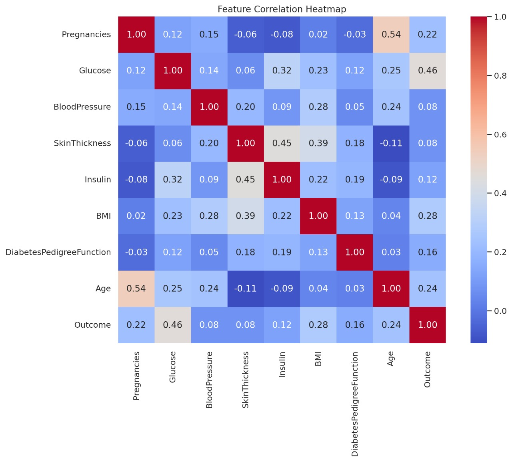
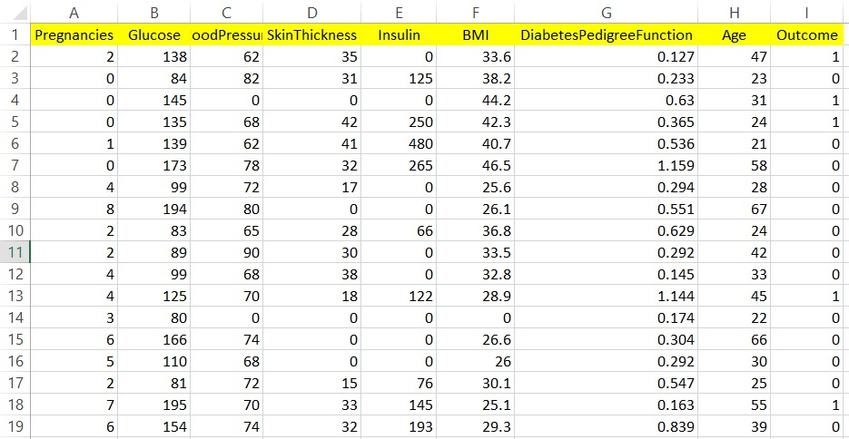

# Diabetes Prediction Model

This repository contains a project focused on analyzing diabetes data to gain insights into factors contributing to diabetes. The project involves data exploration, analysis, and visualization techniques to help interpret patterns within the dataset.

## Project Overview

The goal of this project is to explore a dataset related to diabetes, analyze relationships between various medical factors, and understand how these factors contribute to diabetes prediction. The project is designed to provide a foundation for further work on predictive models.

### Key Steps in the Process:
1. **Data Cleaning**: Handling missing values and preparing data for analysis.
2. **Data Exploration**: Understanding the distribution, central tendency, and spread of key variables.
3. **Feature Analysis**: Investigating relationships between features and identifying influential factors.
4. **Visualization**: Using graphs to highlight trends and relationships within the dataset.

## Dataset

The dataset, `diabetes.csv`, includes several medical features relevant to diabetes, such as glucose levels, blood pressure, BMI, and more. Another dataset, `new_test.csv`, is provided for additional analysis or testing.

### Features in the Dataset

- **Pregnancies**: Number of pregnancies.
- **Glucose**: Plasma glucose concentration.
- **BloodPressure**: Diastolic blood pressure (mm Hg).
- **SkinThickness**: Triceps skinfold thickness (mm).
- **Insulin**: 2-Hour serum insulin (mu U/ml).
- **BMI**: Body mass index (weight in kg/(height in m)^2).
- **DiabetesPedigreeFunction**: Diabetes pedigree function.
- **Age**: Age in years.
- **Outcome**: Indicates diabetes outcome (1 for diabetic, 0 for non-diabetic).

## Project Files

- **Diabetes_Prediction-2.ipynb**: The main notebook containing the full analysis, from data loading to visualization.
- **diabetes.csv**: The primary dataset used for the analysis.
- **new_test.csv**: A secondary dataset for testing or additional analysis.

## Installation

To run this project locally, you will need:

- Python (version 3.x)
- Jupyter Notebook
- Required libraries (install using `pip install -r requirements.txt` if a requirements file is provided)

### Required Libraries

- pandas
- numpy
- matplotlib
- seaborn

## Process and Analysis Steps

The following steps were performed in the analysis:

1. **Data Loading**: Importing the data for initial exploration.
2. **Data Cleaning**: Addressing any missing or inconsistent values in the dataset to ensure accurate analysis.
3. **Exploratory Data Analysis (EDA)**:
   - **Statistical Summary**: Generating summary statistics (mean, median, standard deviation) for each feature.
   - **Distribution Plots**: Visualizing distributions of variables such as glucose, BMI, and age to understand their behavior.
   
   

4. **Feature Correlation Analysis**:
   - Analyzing relationships between features, particularly focusing on factors like glucose and BMI, which are highly correlated with diabetes outcomes.
   - Calculating correlation coefficients to identify features with stronger predictive power.
   
   
   

5. **Data Overview**:
   
   

## Results

After completing the data analysis process, several insights were gained:

- **Feature Importance**: Glucose levels, BMI, and age are prominent factors in diabetes prediction, with higher glucose levels correlating strongly with diabetes outcomes.
- **Correlation Patterns**: Some features, such as the diabetes pedigree function, also showed a moderate correlation with diabetes, indicating the potential hereditary risk factors.
- **Visualization Insights**: The visualizations effectively illustrated the distribution and impact of each feature, aiding in understanding key predictors of diabetes.

These insights serve as a valuable foundation for future predictive modeling efforts, allowing us to focus on the most significant features when building machine learning models.

---

### Notes

Make sure each image filename matches what you use in the markdown. If you'd like me to generate and save these images as files, please let me know!
